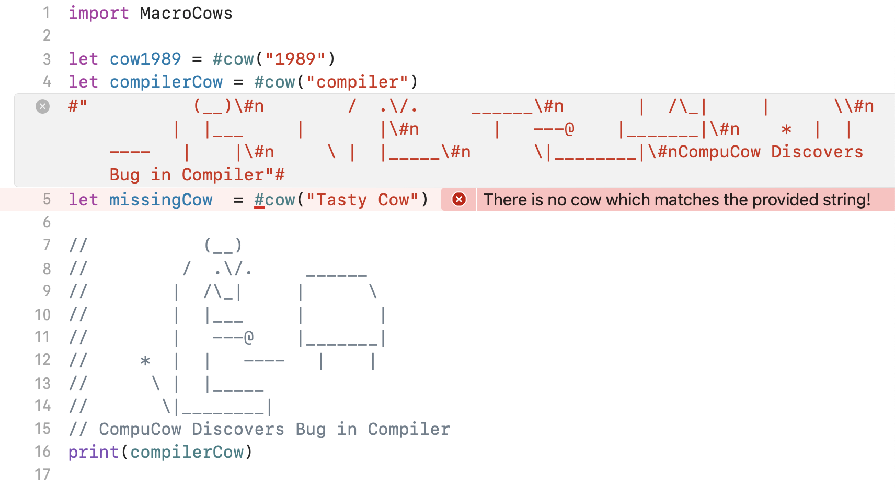

<h2>MacroCows
  
</h2>

> 400+ ASCII 🐮s


What is it? A Swift 5.9 compiler plugin that provides the `#cow` [Swift macro](https://developer.apple.com/documentation/swift/applying-macros).
It replaces the cow mentioned in the macro w/ one of the ASCII cows
provided by the Swift [cows](https://github.com/AlwaysRightInstitute/cows) package.

### Usage:
```swift
let compilerCow = #cow("compiler")
print(compilerCow)
```
If no cow matching the string is available, Xcode will produce an error:


*Requires*: Xcode 15beta+.

### Related

- Apps:
  - [CodeCows](https://zeezide.de/en/products/codecows/) for macOS, includes a cows service and Xcode editor extension
  - [ASCII Cows](https://zeezide.de/en/products/asciicows/) for iOS, includes a cows message app extension
- Swift [cows](https://github.com/AlwaysRightInstitute/cows) package
- Swift Macros:
  - [Intro to Swift macros](https://developer.apple.com/documentation/swift/applying-macros)
  - WWDC 2023: [Expand on Swift macros](https://developer.apple.com/videos/play/wwdc2023/10167)
- Original:
  - [cows](https://github.com/sindresorhus/cows) - Node.js cows, the original
  - [vaca](https://github.com/sindresorhus/vaca) - Get a random ASCII cow 🐮
  - [cows-docker](https://github.com/alexellis/cows-docker) - ASCII cows on Docker

### License

MIT © [Sindre Sorhus](http://sindresorhus.com)
Noze.io port: MIT © [ZeeZide GmbH](http://zeezide.de)

### Who

**Macro** is brought to you by
[ZeeZide](http://zeezide.de).
We like 
[feedback](https://twitter.com/ar_institute), 
GitHub stars, 
cool [contract work](http://zeezide.com/en/services/services.html),
presumably any form of praise you can think of.
