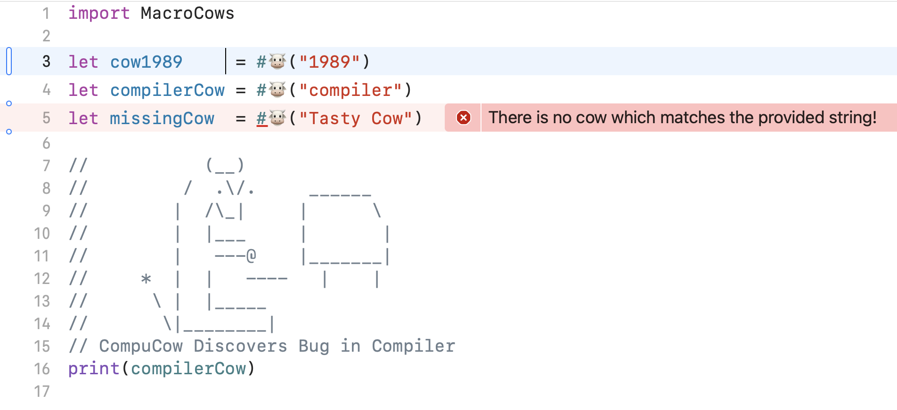

<h2>MacroCows
  
</h2>

> 400+ ASCII 🐮s

### Related

- Swift [cows](https://github.com/AlwaysRightInstitute/cows) package
- Original:
  - [cows](https://github.com/sindresorhus/cows) - Node.js cows, the original
  - [vaca](https://github.com/sindresorhus/vaca) - Get a random ASCII cow 🐮
  - [cows-docker](https://github.com/alexellis/cows-docker) - ASCII cows on Docker

### License

MIT © [Sindre Sorhus](http://sindresorhus.com)
Noze.io port: MIT © [ZeeZide GmbH](http://zeezide.de)

### Who

**Macro** is brought to you by
[ZeeZide](http://zeezide.de).
We like 
[feedback](https://twitter.com/ar_institute), 
GitHub stars, 
cool [contract work](http://zeezide.com/en/services/services.html),
presumably any form of praise you can think of.
